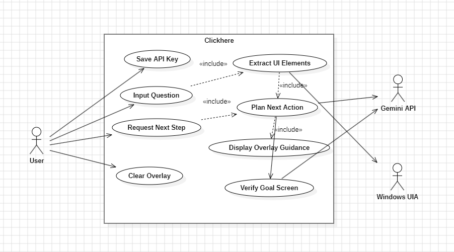
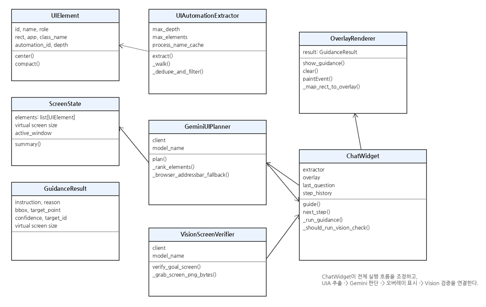
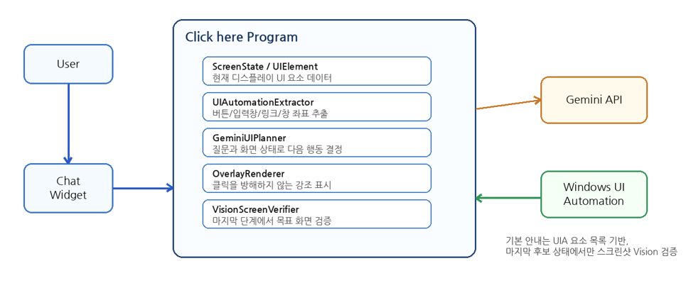
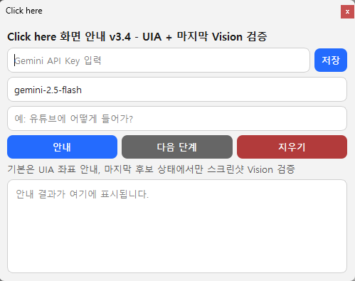
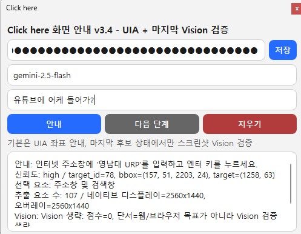
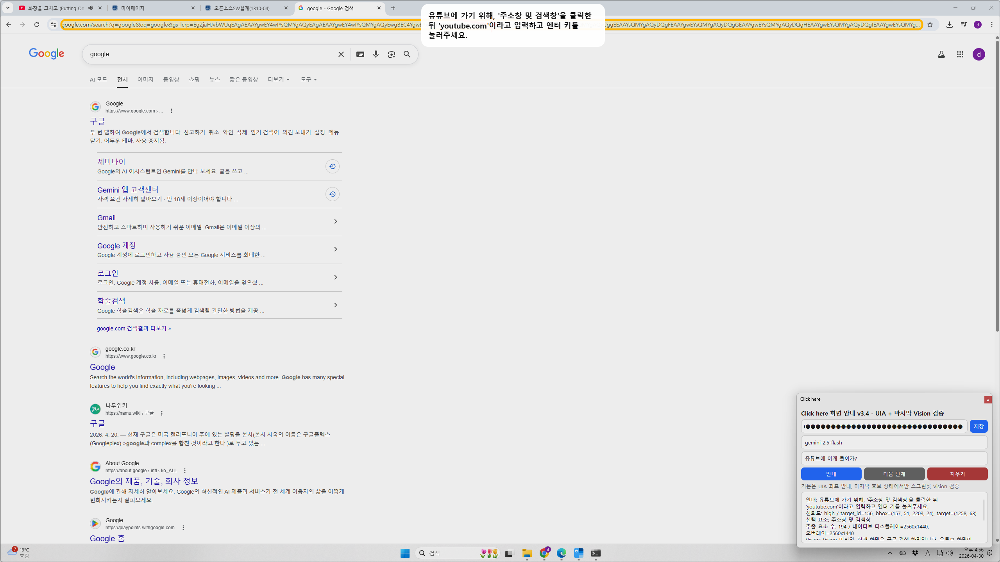
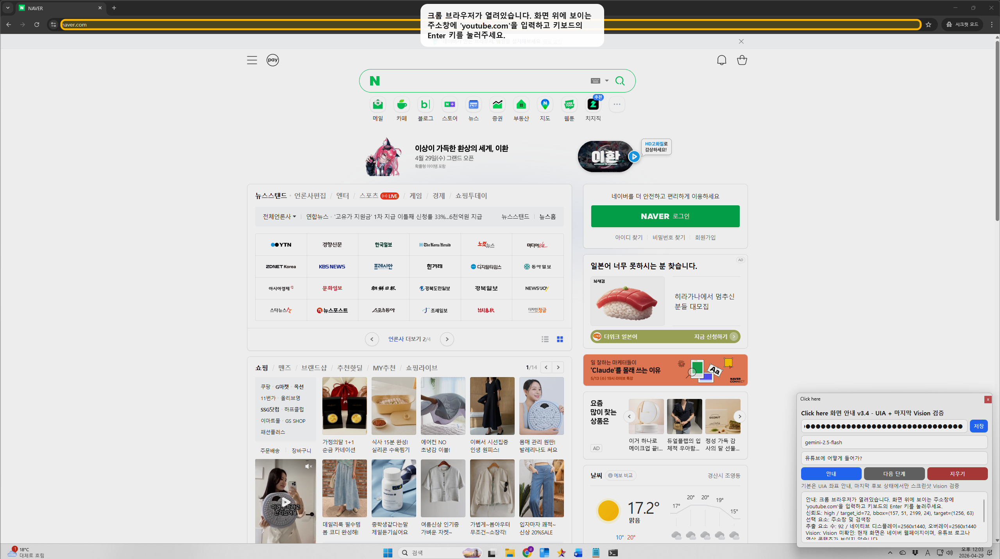
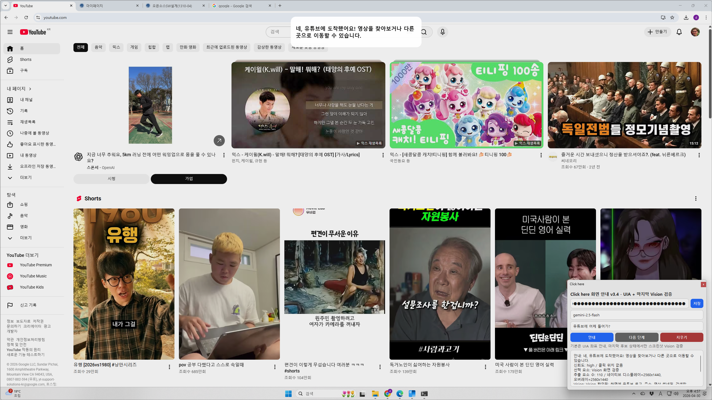
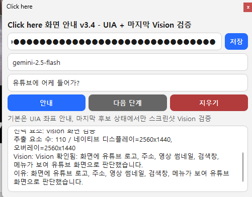

  

# Click here

  

| Student No | Name | E-Mail |
|---|---|---|
| 22413561 | 황지원 | dyint1029@naver.com |

## Revision History

| Revision date | Version # | Description | Author |
|---|---:|---|---|
| 03/25/2026 | 1.00 | First draft | 황지원 |
| 04/28/2026 | 1.10 | Screenshot 기반에서 UIA 기반 요소 추출로 변경, DPI 보정, 마지막 Vision 검증 추가 | 황지원 |

## Contents

- [1. Introduction](#1-introduction)
  - [1.1 Executive Summary](#11-executive-summary)
  - [1.2 Business Goals](#12-business-goals)
  - [1.3 Technical Goals](#13-technical-goals)
- [2. Use Case Analysis](#2-use-case-analysis)
  - [2.1 Use Case Diagram](#21-use-case-diagram)
  - [2.2 Use Case Description](#22-use-case-description)
- [3. Domain Analysis](#3-domain-analysis)
  - [3.1 Domain Class Diagram](#31-domain-class-diagram)
  - [3.2 Class Description](#32-class-description)
  - [3.3 Data Flow](#33-data-flow)
- [4. User Interface Prototype](#4-user-interface-prototype)
  - [4.1 Initial Screen and API Key Setting](#41-initial-screen-and-api-key-setting)
  - [4.2 Question Input Screen](#42-question-input-screen)
  - [4.3 Overlay Guidance Screen](#43-overlay-guidance-screen)
  - [4.4 Next Step Screen](#44-next-step-screen)
  - [4.5 Vision Verification Screen](#45-vision-verification-screen)
- [5. Glossary](#5-glossary)
- [6. References](#6-references)

---

## 1. Introduction

이 보고서는 Conceptualization 단계의 보고서에 이어 Analysis 단계의 보고서입니다. Conceptualization 보고서에서 정의한 지적장애 사용자를 위한 실시간 화면 안내 프로그램 **“Clickhere”** 를 실제 프로토타입 코드 구조에 맞춰 분석하였습니다. 이번 보고서에서는 Use case, Domain, User Interface prototype을 상세히 정리하였습니다.

### 1.1 Executive Summary

오늘날 컴퓨터와 웹 서비스는 교육, 여가, 정보 검색 등 다양한 활동에 필수적으로 사용됩니다. 그러나 지적장애 학생이나 컴퓨터 사용 경험이 적은 사용자는 “유튜브 들어가기”, “네이버 들어가기”, “프로그램 다운로드 받기”와 같이 일반 사용자에게는 간단한 작업도 여러 단계로 나누어 수행해야 하므로 어려움을 겪을 수 있습니다. 기존의 일반적인 설명은 사용자가 현재 화면에서 어떤 버튼을 눌러야 하는지 직접 판단해야 하기 때문에 인지 부담이 커지게 됩니다.

**Clickhere** 는 이러한 문제를 해결하기 위해 만들어진 Windows 데스크톱용 실시간 화면 안내 프로그램입니다. 사용자는 화면 오른쪽 아래에 표시되는 작은 질문 창에 “유튜브 어떻게 들어가?”와 같은 자연어 질문을 입력합니다. 그러면 시스템은 현재 디스플레이에 보이는 버튼, 입력창, 링크, 메뉴, 창 정보를 Windows UI Automation으로 추출하고, Gemini API를 통해 지금 해야 할 행동 하나를 결정합니다. 결정된 위치는 반투명 오버레이의 강조 박스와 안내 문장으로 표시됩니다.

이번 프로토타입의 핵심 특징은 저번 개념화 단계와 달리 전체 스크린샷을 매번 AI에게 보내지 않는다는 점입니다. 기본 안내 단계에서는 UI Automation으로 추출한 실제 UI 요소 목록만 Gemini에게 전달하고, Gemini는 그 중 `target_id` 하나를 선택합니다. 따라서 오버레이는 AI가 임의로 추정한 좌표가 아니라 실제 UI 요소의 좌표 위에 표시됩니다. 또한 DPI와 해상도 배율 차이를 자동으로 계산하여 UIA 좌표와 PyQt 오버레이 좌표의 불일치를 줄이고, 마지막 후보 상태에서만 스크린샷 기반 Vision 검증을 수행합니다.

### 1.2 Business Goals

- 지적장애 사용자와 컴퓨터 초보자가 복잡한 컴퓨터 작업을 한 단계씩 수행할 수 있도록 돕기 위함입니다.
- 특수학교, 복지관, 디지털 교육 기관에서 교사의 반복 안내 부담을 줄일 수 있습니다.
- 사용자가 긴 설명을 한 번에 이해하지 못하더라도, 현재 화면에서 지금 눌러야 할 위치를 직관적으로 알 수 있습니다.
- 브라우저 사용, 검색, 프로그램 실행 등 일상적인 디지털 활동의 접근성을 높입니다.

### 1.3 Technical Goals

- Windows UI Automation을 이용하여 현재 화면에 존재하는 버튼, 입력창, 링크, 메뉴, 창 요소를 추출합니다.
- Gemini API를 이용하여 사용자 질문과 UI 요소 목록을 비교하고 다음 행동 하나를 결정합니다.
- PyQt6 기반의 ChatWidget과 Overlay Renderer를 통해 항상 위에 표시되는 질문창과 클릭 방해 없는 오버레이를 구현합니다.
- Windows DPI awareness와 virtual screen 좌표 계산을 통해 해상도 및 배율 변화에도 좌표가 어긋나지 않도록 합니다.
- 브라우저 목표 작업의 마지막 단계에서는 VisionScreenVerifier가 스크린샷을 사용해 목표 화면 도착 여부를 확인합니다.
- 개인정보 입력, 결제, 삭제, 전송 같은 위험 행동은 직접 클릭하지 않도록 합니다.

---

## 2. Use Case Analysis

### 2.1 Use Case Diagram

아래 그림은 Clickhere 시스템의 주요 Actor와 Use Case의 관계를 나타낸 것입니다. 주 Actor는 User이며, 외부 시스템으로는 Gemini API와 Windows UI Automation이 존재합니다. User는 API 키 저장, 질문 입력, 다음 단계 요청, 오버레이 지우기와 같은 기능을 직접 수행합니다.

  

| Use Case ID | Use Case Name | Korean Name | Primary Actor |
|---|---|---|---|
| #1 | Save API Key | Gemini API 키 저장 | User |
| #2 | Input Question | 질문 입력 및 첫 안내 요청 | User |
| #3 | Extract UI Elements | 현재 화면 UI 요소 추출 | System, Windows UIA |
| #4 | Plan Next Action | 다음 행동 결정 | System, Gemini API |
| #5 | Display Overlay Guidance | 오버레이 안내 표시 | System |
| #6 | Request Next Step | 다음 단계 요청 | User |
| #7 | Verify Goal Screen | 목표 화면 Vision 검증 | System, Gemini API |
| #8 | Clear Overlay | 오버레이 지우기 | User |

### 2.2 Use Case Description

#### Use Case #1 : Save API Key

##### General Characteristics

| Item | Content |
|---|---|
| Summary | 사용자가 Gemini API Key를 입력하고 프로그램 내부 파일에 저장한다. |
| Scope | Click here |
| Level | User Level |
| Author | 황지원 |
| Last Update | 04/28/2026 |
| Status | Analysis |
| Primary Actor | User |
| Preconditions | 프로그램이 실행되어 있고 Gemini API Key를 발급받은 상태여야 한다. |
| Trigger | 사용자가 API Key 입력 칸에 키를 입력하고 저장 버튼을 누른다. |
| Success Post Condition | API Key가 `.gemini_key` 파일에 저장되고 이후 안내 기능에서 사용할 수 있다. |
| Failed Post Condition | 키가 저장되지 않아 Gemini 기반 안내 기능을 사용할 수 없다. |

##### Main Success Scenario

| Step | Action |
|---|---|
| S | 사용자가 API Key 입력칸에 키를 입력하고 저장 버튼을 누른다. |
| 1 | 사용자가 Click here 프로그램을 실행한다. |
| 2 | 시스템은 질문 창 상단에 Gemini API Key 입력칸을 보여준다. |
| 3 | 사용자는 발급받은 API Key를 입력한다. |
| 4 | 사용자가 저장 버튼을 누른다. |
| 5 | 시스템은 입력된 키를 `.gemini_key` 파일에 저장한다. |
| 6 | 저장 완료 메시지를 상태창에 표시한다. |

##### Extension Scenarios

| Step | Branching Action |
|---|---|
| 3~4 사이 | API Key가 비어 있는 경우: 시스템은 키를 입력해 달라는 경고 메시지를 띄운다. |
| 5~6 사이 | 파일 저장 권한 문제가 발생한 경우: 시스템은 오류 내용을 상태창과 메시지 박스로 보여준다. |

##### Related Information

| Item | Content |
|---|---|
| Performance | <= 3 Seconds |
| Frequency | 초기 설정 시 1회, 키 변경 시 추가 실행 |
| Concurrency | None |
| Due Date |  |
| Other | 키는 `.env` 또는 `.gemini_key`에서 불러올 수 있다. |

#### Use Case #2 : Input Question

##### General Characteristics

| Item | Content |
|---|---|
| Summary | 사용자가 자연어 질문을 입력하여 첫 번째 화면 안내를 요청한다. |
| Scope | Click here |
| Level | User Level |
| Author | 황지원 |
| Last Update | 04/28/2026 |
| Status | Analysis |
| Primary Actor | User |
| Secondary Actor | Gemini API |
| Preconditions | API Key가 입력되어 있고 프로그램이 실행 중이어야 한다. |
| Trigger | 사용자가 질문 입력칸에 질문을 입력한 후 안내 버튼 또는 Enter를 누른다. |
| Success Post Condition | 시스템이 현재 화면을 분석하고 다음 행동 하나를 오버레이로 표시한다. |
| Failed Post Condition | 질문이 비어 있거나 API 호출에 실패하여 안내를 제공하지 못한다. |

##### Main Success Scenario

| Step | Action |
|---|---|
| S | 사용자가 질문 입력칸에 질문을 입력한 후 안내 버튼 또는 Enter를 누른다. |
| 1 | 사용자는 오른쪽 아래의 질문창에 질문을 입력한다. |
| 2 | 사용자는 안내 버튼을 누르거나 Enter를 입력한다. |
| 3 | 시스템은 이전 단계 기록을 초기화하고 질문을 `last_question`으로 저장한다. |
| 4 | 시스템은 현재 디스플레이의 UI 요소를 추출한다. |
| 5 | GeminiUIPlanner가 질문과 UI 요소 목록을 바탕으로 다음 행동을 결정한다. |
| 6 | OverlayRenderer가 선택된 요소 위치에 강조 박스와 안내 문장을 표시한다. |

##### Extension Scenarios

| Step | Branching Action |
|---|---|
| 1~2 사이 | 질문이 비어 있는 경우: 시스템은 “질문을 입력해 주세요.” 메시지를 띄운다. |
| 4~5 사이 | UI 요소를 찾지 못한 경우: 시스템은 창을 한 번 클릭한 뒤 다시 안내를 누르라는 안내를 제공한다. |
| 5~6 사이 | Gemini API 호출 오류가 발생한 경우: 오류 내용을 상태창에 표시하고 오버레이를 지운다. |

##### Related Information

| Item | Content |
|---|---|
| Performance | 질문 입력 후 가능한 빠르게, 일반적으로 수 초 이내 |
| Frequency | 사용자가 도움을 요청할 때마다 |
| Concurrency | 한 사용자의 단일 데스크톱 환경 기준 |
| Due Date |  |
| Other | 질문 예시: “유튜브에 어떻게 들어가?” |

#### Use Case #3 : Extract UI Elements

##### General Characteristics

| Item | Content |
|---|---|
| Summary | 현재 디스플레이에 표시되는 버튼, 입력창, 링크, 메뉴, 창 등의 UI 요소를 Windows UI Automation으로 추출한다. |
| Scope | Click here |
| Level | System Level |
| Author | 황지원 |
| Last Update | 04/28/2026 |
| Status | Analysis |
| Primary Actor | System |
| Secondary Actor | Windows UI Automation |
| Preconditions | Windows 환경에서 `uiautomation` 패키지가 정상적으로 동작해야 한다. |
| Trigger | 질문 입력 또는 다음 단계 요청으로 화면 분석이 필요할 때 |
| Success Post Condition | ScreenState 객체에 UIElement 목록과 가상 화면 좌표 정보가 저장된다. |
| Failed Post Condition | 추출된 요소가 없거나 잘못된 좌표로 인해 안내 정확도가 낮아진다. |

##### Main Success Scenario

| Step | Action |
|---|---|
| S | 질문 입력 또는 다음 단계 요청으로 화면 분석이 필요할 때 |
| 1 | 시스템은 Windows의 가상 화면 좌표와 크기를 가져온다. |
| 2 | 현재 포커스된 컨트롤 이름을 active_window 힌트로 저장한다. |
| 3 | 루트 컨트롤에서 최상위 윈도우 목록을 가져온다. |
| 4 | 각 윈도우의 자식 컨트롤을 max_depth 범위 안에서 순회한다. |
| 5 | 역할, 이름, 클래스명, 자동화 ID, BoundingRectangle을 읽는다. |
| 6 | 너무 작거나 화면 밖에 있는 요소, Click here 자체 UI 요소, 중복 요소를 제거한다. |
| 7 | 추출된 요소를 클릭 가능성과 이름 여부 등을 기준으로 정렬하고 ScreenState를 반환한다. |

##### Extension Scenarios

| Step | Branching Action |
|---|---|
| 3~4 사이 | 최상위 윈도우 목록을 가져오지 못한 경우: 빈 목록으로 처리하고 안내 실패 메시지를 생성한다. |
| 5~6 사이 | BoundingRectangle을 읽지 못한 경우: 해당 요소는 제외한다. |
| 6~7 사이 | 접근성 트리를 제공하지 않는 앱인 경우: 요소 수가 적어질 수 있다. |

##### Related Information

| Item | Content |
|---|---|
| Performance | <= 3 Seconds 목표 |
| Frequency | 질문 입력 및 다음 단계마다 |
| Concurrency | 제한 없음 |
| Due Date |  |
| Other | Chrome 웹페이지 내부 요소가 부족한 경우 접근성 옵션이 필요할 수 있다. |

#### Use Case #4 : Plan Next Action

##### General Characteristics

| Item | Content |
|---|---|
| Summary | 사용자 질문, 현재 UI 요소 목록, 이전 안내 기록을 바탕으로 지금 해야 할 행동 하나를 결정한다. |
| Scope | Click here |
| Level | System Level |
| Author | 황지원 |
| Last Update | 04/28/2026 |
| Status | Analysis |
| Primary Actor | System |
| Secondary Actor | Gemini API |
| Preconditions | ScreenState가 생성되어 있고 Gemini API Key가 유효해야 한다. |
| Trigger | UI 요소 추출이 끝난 후 |
| Success Post Condition | GuidanceResult가 생성되어 target_id, 안내 문장, 이유, 신뢰도를 포함한다. |
| Failed Post Condition | 대상 요소를 찾지 못하거나 `target_id`가 `null`로 반환된다. |

##### Main Success Scenario

| Step | Action |
|---|---|
| S | UI 요소 추출이 끝난 후 |
| 1 | 시스템은 UIElement 목록을 질문과 관련성에 따라 순위화한다. |
| 2 | 최근 안내 기록을 JSON으로 변환한다. |
| 3 | Gemini에게 질문, 화면 요약, UI 요소 목록, 이전 안내 기록을 전달한다. |
| 4 | Gemini는 elements 안에서 `target_id` 하나를 선택하거나 불확실하면 `null`을 반환한다. |
| 5 | 시스템은 `target_id`에 해당하는 UIElement를 찾아 bbox와 target_point를 계산한다. |
| 6 | 브라우저/YouTube 관련 질문의 경우 주소창 fallback 로직으로 결과를 보정한다. |
| 7 | GuidanceResult를 반환한다. |

##### Extension Scenarios

| Step | Branching Action |
|---|---|
| 4~5 사이 | Gemini가 `target_id`를 잘못 반환한 경우: `target_id`를 `null` 처리하고 일반 안내 문장을 표시한다. |
| 6~7 사이 | YouTube 화면이 이미 보이는 경우: 주소창 반복 안내 대신 YouTube 검색창 또는 화면 내 YouTube 요소를 안내한다. |
| 6~7 사이 | 브라우저는 보이지만 주소창 요소가 잡히지 않는 경우: Ctrl+L 단축키 안내로 보정한다. |

##### Related Information

| Item | Content |
|---|---|
| Performance | Gemini API 응답 시간에 따라 달라짐 |
| Frequency | 화면 안내가 필요할 때마다 |
| Concurrency | API 사용량 제한에 따름 |
| Due Date |  |
| Other | 위험 행동은 직접 클릭하도록 안내하지 않는 규칙을 포함한다. |

#### Use Case #5 : Display Overlay Guidance

##### General Characteristics

| Item | Content |
|---|---|
| Summary | 결정된 대상 위치 위에 클릭을 방해하지 않는 투명 오버레이, 강조 박스, 안내 문장을 표시한다. |
| Scope | Click here |
| Level | System Level |
| Author | 황지원 |
| Last Update | 04/28/2026 |
| Status | Analysis |
| Primary Actor | System |
| Preconditions | GuidanceResult가 생성되어 있어야 한다. |
| Trigger | 다음 행동 결정이 완료되었을 때 |
| Success Post Condition | 사용자는 현재 화면에서 눌러야 할 위치와 간단한 안내 문장을 볼 수 있다. |
| Failed Post Condition | 좌표 변환 오류 또는 UI 요소 미선택으로 위치 안내가 표시되지 않는다. |

##### Main Success Scenario

| Step | Action |
|---|---|
| S | 다음 행동 결정이 완료되었을 때 |
| 1 | OverlayRenderer는 현재 가상 화면 크기에 맞게 자신의 크기를 조정한다. |
| 2 | GuidanceResult를 내부 result로 저장한다. |
| 3 | 오버레이 창을 항상 위에 표시한다. |
| 4 | bbox가 있는 경우 UIA 좌표를 PyQt 오버레이 좌표로 변환한다. |
| 5 | 대상 위치에 노란색 강조 박스, 붉은 십자 표시, 화살표를 그린다. |
| 6 | 안내 문장을 흰색 말풍선 형태로 표시한다. |
| 7 | 오버레이는 마우스 이벤트를 통과시켜 사용자의 실제 클릭을 방해하지 않는다. |

##### Extension Scenarios

| Step | Branching Action |
|---|---|
| 4~5 사이 | bbox가 없는 경우: 화면 상단 중앙에 안내 문장만 표시한다. |
| 5~6 사이 | 좌표 배율이 맞지 않는 경우: virtual screen 크기와 overlay 크기의 scale factor로 보정한다. |

##### Related Information

| Item | Content |
|---|---|
| Performance | 즉시 표시 |
| Frequency | 안내 결과가 생성될 때마다 |
| Concurrency | 단일 오버레이 |
| Due Date |  |
| Other | `WindowTransparentForInput`, `WA_TransparentForMouseEvents`를 사용한다. |

#### Use Case #6 : Request Next Step

##### General Characteristics

| Item | Content |
|---|---|
| Summary | 사용자가 안내된 행동을 수행한 후 다음 단계를 요청한다. |
| Scope | Click here |
| Level | User Level |
| Author | 황지원 |
| Last Update | 04/28/2026 |
| Status | Analysis |
| Primary Actor | User |
| Preconditions | 이전 질문이 존재하고 안내 기록이 저장되어 있어야 한다. |
| Trigger | 사용자가 다음 단계 버튼을 누른다. |
| Success Post Condition | 현재 화면과 이전 단계 기록을 비교하여 다음 행동을 다시 안내한다. |
| Failed Post Condition | 이전 질문이 없거나 화면 변화 판단에 실패한다. |

##### Main Success Scenario

| Step | Action |
|---|---|
| S | 사용자가 다음 단계 버튼을 누른다. |
| 1 | 사용자는 이전 안내에 따라 버튼 클릭 또는 입력 등의 행동을 수행한다. |
| 2 | 사용자가 질문창의 다음 단계 버튼을 누른다. |
| 3 | 시스템은 `last_question`을 사용하여 동일 목표를 유지한다. |
| 4 | 시스템은 현재 화면 UI 요소를 다시 추출한다. |
| 5 | GeminiUIPlanner는 previous_steps와 현재 화면 요소 목록을 비교한다. |
| 6 | 화면이 바뀐 증거가 있으면 다음 행동을 안내하고, 바뀌지 않았으면 같은 행동을 다른 문장으로 다시 안내한다. |
| 7 | 새로운 GuidanceResult를 `step_history`에 저장한다. |

##### Extension Scenarios

| Step | Branching Action |
|---|---|
| 2~3 사이 | 이전 질문이 없는 경우: “먼저 질문을 입력하고 안내를 받아 주세요.” 메시지를 띄운다. |
| 5~6 사이 | 사용자가 돌발 행동으로 다른 프로그램을 연 경우: 현재 화면 기준으로 행동 리스트를 다시 계획한다. |
| 7~8 사이 | 직전 단계와 완전히 같은 GuidanceStep이면 중복 저장하지 않는다. |

##### Related Information

| Item | Content |
|---|---|
| Performance | 질문 입력 Use Case와 동일 |
| Frequency | 복수 단계 작업에서 반복 |
| Concurrency | None |
| Due Date |  |
| Other | `step_history`는 최근 10개까지만 유지한다. |

#### Use Case #7 : Verify Goal Screen

##### General Characteristics

| Item | Content |
|---|---|
| Summary | 웹/브라우저 목표에서 마지막 후보 상태라고 판단될 때 스크린샷을 Gemini Vision에 보내 목표 화면 도착 여부를 확인한다. |
| Scope | Click here |
| Level | System Level |
| Author | 황지원 |
| Last Update | 04/28/2026 |
| Status | Analysis |
| Primary Actor | System |
| Secondary Actor | Gemini API |
| Preconditions | 브라우저 목표 작업이며 Vision 검증 점수가 기준 이상이어야 한다. |
| Trigger | `_should_run_vision_check()`가 `score >= 2`를 반환한다. |
| Success Post Condition | 목표 화면 도착이 확인되면 클릭 위치 없는 완료 안내 또는 다음 행동 안내로 교체된다. |
| Failed Post Condition | Vision 검증이 실패하거나 낮은 신뢰도이면 기존 UIA 안내를 유지한다. |

##### Main Success Scenario

| Step | Action |
|---|---|
| S | `_should_run_vision_check()`가 `score >= 2`를 반환한다. |
| 1 | 시스템은 현재 안내 결과와 `step_history`를 확인한다. |
| 2 | 웹/브라우저 목표인지 판단한다. |
| 3 | 이전 단계가 주소 입력/Enter였는지, 브라우저 요소가 보이는지, YouTube 관련 단서가 있는지 점수화한다. |
| 4 | 점수가 2점 이상이면 오버레이를 잠시 지운다. |
| 5 | 현재 화면 스크린샷을 캡처한다. |
| 6 | Gemini Vision에게 목표 화면 도착 여부를 JSON으로 요청한다. |
| 7 | `is_goal_screen`이 true이고 신뢰도가 low가 아니면 GuidanceResult를 완료 안내로 교체한다. |

##### Extension Scenarios

| Step | Branching Action |
|---|---|
| 3~4 사이 | 점수가 2점 미만인 경우: Vision 검증을 생략한다. |
| 5~6 사이 | 스크린샷을 가져오지 못한 경우: 목표 화면이 아니라고 처리한다. |
| 7~8 사이 | Vision 신뢰도가 low인 경우: 기존 UIA 안내를 유지한다. |

##### Related Information

| Item | Content |
|---|---|
| Performance | 마지막 후보 상태에서만 수행, Gemini Vision 응답 시간에 따라 달라짐 |
| Frequency | 웹/브라우저 목표의 마지막 후보 상태에서만 |
| Concurrency | API 사용량 제한에 따름 |
| Due Date |  |
| Other | 개인정보 보호를 위해 필요한 경우에만 스크린샷을 사용한다. |

#### Use Case #8 : Clear Overlay

##### General Characteristics

| Item | Content |
|---|---|
| Summary | 사용자가 현재 화면 위에 표시된 오버레이 안내를 지운다. |
| Scope | Click here |
| Level | User Level |
| Author | 황지원 |
| Last Update | 04/28/2026 |
| Status | Analysis |
| Primary Actor | User |
| Preconditions | 오버레이가 표시되어 있거나 표시 가능한 상태여야 한다. |
| Trigger | 사용자가 지우기 버튼을 누른다. |
| Success Post Condition | 오버레이가 사라지고 화면 조작이 더 자유로워진다. |
| Failed Post Condition | 오버레이 객체 오류로 화면에서 사라지지 않는다. |

##### Main Success Scenario

| Step | Action |
|---|---|
| S | 사용자가 지우기 버튼을 누른다. |
| 1 | 사용자는 질문창에서 지우기 버튼을 누른다. |
| 2 | `OverlayRenderer.clear()`가 호출된다. |
| 3 | OverlayRenderer는 result를 None으로 설정한다. |
| 4 | 오버레이 창을 숨긴다. |

##### Extension Scenarios

| Step | Branching Action |
|---|---|
| 2~3 사이 | 이미 오버레이가 숨겨진 상태인 경우: 변화 없이 정상 종료한다. |

##### Related Information

| Item | Content |
|---|---|
| Performance | 즉시 |
| Frequency | 사용자가 원할 때마다 |
| Concurrency | None |
| Due Date |  |
| Other | 질문 기록 자체를 삭제하지는 않는다. |

---

## 3. Domain Analysis

### 3.1 Domain Class Diagram

Domain analysis에서는 Clickhere의 `main.py`에 구현된 핵심 클래스들을 기준으로 시스템의 도메인 객체를 추출하였습니다. 이 프로그램은 여러 파일로 분리된 구조가 아니라 하나의 `main.py` 안에 데이터 클래스, UIA 추출기, Gemini 계획기, Vision 검증기, PyQt UI 클래스가 함께 존재합니다. 따라서 실제 구현 클래스가 곧 분석 단계의 주요 도메인 클래스가 됩니다.

  

### 3.2 Class Description

| Class | Description |
|---|---|
| UIElement | Windows UI Automation으로 추출한 화면 요소 하나를 표현한다. 버튼, 입력창, 링크, 메뉴, 창 등의 이름과 좌표를 가진다. |
| ScreenState | 현재 전체 디스플레이의 화면 상태를 표현한다. UIElement 목록과 가상 화면 좌표, 활성 창 힌트를 가진다. |
| GuidanceResult | AI가 결정한 안내 결과를 표현한다. 안내문, 이유, 대상 좌표, 신뢰도, 선택된 `target_id`를 포함한다. |
| GuidanceStep | 이전에 사용자에게 제공한 안내 기록을 표현한다. 다음 단계 판단 시 이전 안내와 현재 화면 변화 여부를 비교하는 데 사용된다. |
| UIAutomationExtractor | 현재 화면에 표시된 UI 요소를 Windows UI Automation으로 추출한다. 작은 요소, 중복 요소, 프로그램 자체 UI를 필터링한다. |
| GeminiUIPlanner | UI 요소 목록과 사용자 질문을 Gemini API에 전달하여 다음에 눌러야 할 요소를 선택한다. YouTube/브라우저 관련 fallback을 포함한다. |
| VisionScreenVerifier | 마지막 후보 상태에서만 스크린샷을 Gemini Vision에 전달하여 목표 화면 도착 여부를 검증한다. |
| OverlayRenderer | 투명 오버레이를 화면 위에 표시한다. 대상 box 위에 강조 박스, 십자 표시, 화살표, 안내 말풍선을 그린다. |
| ChatWidget | 사용자와 직접 상호 작용하는 오른쪽 아래 질문 창이다. API Key 입력, 질문 입력, 안내, 다음 단계, 지우기 버튼을 제공하며 전체 흐름을 제어한다. |
| enable_windows_dpi_awareness | Windows DPI awareness를 활성화하여 UIA 좌표와 PyQt 좌표가 같은 기준을 사용하도록 돕는다. |
| get_native_virtual_screen_rect | Windows의 전체 가상 화면 좌표와 크기를 가져온다. 다중 모니터와 배율 환경에서 좌표 변환 기준이 된다. |

### 3.3 Data Flow

아래 그림은 Clickhere의 데이터 흐름을 나타냅니다. 사용자의 질문은 ChatWidget에 입력되고 ChatWidget은 UIAutomationExtractor를 통해 현재 화면의 UIElement 목록을 수집합니다. 수집된 정보는 ScreenState로 정리되어 GeminiUIPlanner에 전달됩니다. GeminiUIPlanner는 질문과 화면 상태를 비교해 GuidanceResult를 만들고 OverlayRenderer가 이를 시각적으로 표시합니다. 사용자가 다음 단계 버튼을 누르면 GuidanceStep 기록과 새 ScreenState를 비교하여 다음 행동을 다시 결정합니다.

  

---

## 4. User Interface Prototype

User Interface prototype은 실제 Clickhere의 PyQt6 화면 구성을 기준으로 작성되었습니다. 프로그램은 별도의 큰 메인 창을 사용하는 대신, 화면 오른쪽 아래에 작은 질문 입력창을 항상 표시합니다. 사용자가 안내를 요청하면 전체 화면 위에 투명 오버레이가 나타나며, 실제 클릭은 오버레이에 막히지 않고 원래 프로그램으로 전달됩니다.

### 4.1 Initial Screen and API Key Setting

프로그램을 실행하면 오른쪽 아래에 Clickhere 창이 나타납니다. 사용자는 Gemini API Key 입력 칸에 키를 입력하고 저장 버튼을 누릅니다. 저장된 키는 다음 실행 시 자동으로 불러올 수 있습니다. 모델명 입력 칸에는 기본값으로 `gemini-2.5-flash`가 표시됩니다.

  
  

| UI Element | Description |
|---|---|
| Gemini API Key 입력칸 | 사용자가 발급받은 Gemini API Key를 입력하는 비밀번호 형태의 입력창 |
| 저장 버튼 | 입력된 API Key를 `.gemini_key` 파일에 저장 |
| 모델명 입력칸 | 사용할 Gemini 모델명을 입력. 기본값은 `gemini-2.5-flash` |
| 상태창 | 저장 성공, 오류, 안내 결과, 신뢰도, 선택 요소 정보를 표시 |

### 4.2 Question Input Screen

질문 입력칸은 사용자가 원하는 목표를 자연어로 입력하는 부분입니다. 예를 들어 “유튜브에 어케 들어가?”와 같이 짧은 문장을 입력하고 안내 버튼을 누르면 시스템이 첫 안내를 시작합니다. 질문 입력 후 Enter를 눌러도 동일하게 `guide()` 함수가 실행됩니다.

| Button | Function |
|---|---|
| 안내 | 새로운 질문을 기준으로 첫 안내를 시작하고 `step_history`를 초기화한다. |
| 다음 단계 | 이전 질문과 이전 안내 기록을 유지한 상태로 현재 화면을 다시 분석한다. |
| 지우기 | 현재 표시된 오버레이를 숨긴다. |

### 4.3 Overlay Guidance Screen

오버레이는 전체 화면 위에 투명하게 표시됩니다. 대상 UI 요소가 존재하는 경우 해당 BoundingRectangle 위에 노란색 강조 박스가 그려지고, 중심점에는 붉은 십자 표시와 화살표가 나타납니다. 사용자가 이해하기 쉽도록 말풍선에는 “크롬 브라우저가 열려있습니다. 주소창에 `youtube.com`을 입력하고 키보드의 Enter 키를 눌러주세요.”와 같이 짧고 직접적인 문장이 표시됩니다.

오버레이는 `WindowTransparentForInput`과 `WA_TransparentForMouseEvents`를 사용하므로, 사용자의 클릭을 가로막지 않습니다. 즉, 사용자는 표시된 위치를 그대로 클릭할 수 있으며 실제 클릭은 뒤에 있는 Chrome, Edge, Windows 설정 등 원래 프로그램으로 전달됩니다.

  

  

### 4.4 Next Step Screen

사용자가 안내된 행동을 수행한 뒤 다음 단계 버튼을 누르면 시스템은 현재 화면을 다시 분석합니다. 이때 단순히 “이전 행동이 완료되었다”고 가정하지 않고, `previous_steps`와 현재 UI 요소 목록을 비교하여 실제 화면이 바뀌었는지 판단합니다. 화면이 바뀌었다면 다음 단계로 진행하고, 바뀌지 않았다면 같은 행동을 반복하되 이전 문장과 완전히 똑같이 반복하지 않도록 합니다.

### 4.5 Vision Verification Screen

기본 안내는 개인정보 보호와 속도를 고려하여 스크린샷을 사용하지 않고 UIA 요소 목록만 Gemini에게 전달합니다. 다만 YouTube와 같은 웹 목표 작업에서 마지막 후보 상태라고 판단되면, 시스템은 잠시 오버레이를 지우고 현재 스크린샷을 Gemini Vision에 보내 목표 화면 도착 여부를 확인합니다. 목표 화면이라고 확인되면 더 이상 주소창 클릭을 반복하지 않고, “YouTube 화면에 도착했습니다. 검색창에 보고 싶은 영상을 입력하세요.”와 같은 완료 또는 다음 행동 안내를 표시합니다.

  

  

---

## 5. Glossary

| Term | Description |
|---|---|
| Click here | 지적장애 사용자와 컴퓨터 초보자를 위해 현재 화면에서 눌러야 할 위치를 안내하는 Windows 데스크톱 프로그램 |
| Chat Widget | 화면 오른쪽 아래에 항상 표시되는 질문 입력창 |
| Overlay | 현재 화면 위에 표시되는 투명 안내 레이어 |
| UI Automation / UIA | Windows 프로그램의 버튼, 입력창, 링크, 메뉴 등 접근성 정보를 읽는 기술 |
| BoundingRectangle | UIA 요소가 화면에서 차지하는 좌표와 크기 정보 |
| DPI Awareness | Windows 화면 배율이 달라져도 프로그램 좌표가 어긋나지 않도록 하는 설정 |
| Virtual Screen | 다중 모니터를 포함한 Windows 전체 가상 화면 영역 |
| Gemini API | Google Gemini 모델을 프로그램에서 호출하기 위한 외부 AI API |
| Gemini Vision | 이미지 또는 스크린샷을 함께 입력받아 화면 상태를 판단하는 Gemini 기능 |
| Guidance Planner | 사용자의 질문과 현재 화면 상태를 바탕으로 다음 행동 하나를 결정하는 모듈 |
| GuidanceResult | AI가 생성한 안내 결과 데이터 |
| GuidanceStep | 이전 단계 안내 기록 데이터 |
| PyQt6 | Python에서 GUI 프로그램을 만들기 위한 Qt 기반 프레임워크 |
| Target ID | UI 요소 목록 중 Gemini가 선택한 대상 요소의 고유 번호 |
| Fallback | AI 판단이 불확실하거나 브라우저 주소창을 직접 찾지 못했을 때 사용하는 보정 규칙 |

---

## 6. References

1. Python Software Foundation, Python Documentation.
2. Riverbank Computing, PyQt6 Documentation.
3. Microsoft, Windows UI Automation Documentation.
4. Google, Gemini API Documentation.
