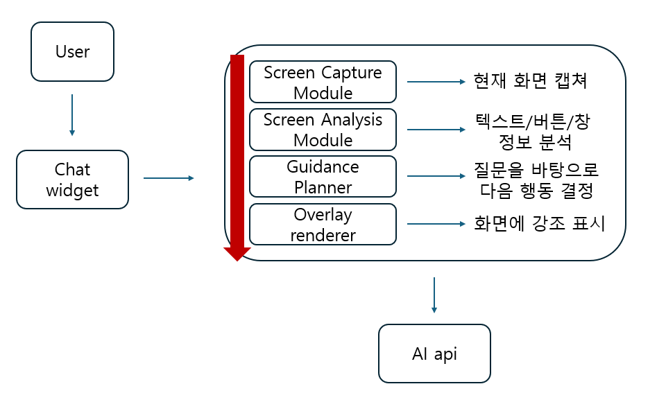

  

<h1 align="center">Click here</h1>

  

<table align="center">
  <tr>
    <td align="center"><b>Student No</b></td>
    <td align="center">22413561</td>
  </tr>
  <tr>
    <td align="center"><b>Name</b></td>
    <td align="center">황지원</td>
  </tr>
  <tr>
    <td align="center"><b>E-Mail</b></td>
    <td align="center">dyint1029@naver.com</td>
  </tr>
</table>

 

## Revision history

| Revision date | Version # | Description | Author |
|---|---:|---|---|
| 03/25/2026 | 1.00 | First draft | 황지원 |

## Contents

- [1. Business purpose](#1-business-purpose)
- [2. System context diagram](#2-system-context-diagram)
- [3. Use case list](#3-use-case-list)
- [4. Concept of operation](#4-concept-of-operation)
- [5. Problem statement](#5-problem-statement)
- [6. Glossary](#6-glossary)
- [7. References](#7-references)

---

## 1. Business purpose

### 1.1 Project background

오늘날 장애인 인식 개선 및 교육의 확대와 인공지능의 발전으로 특수학생들에게 컴퓨터 교육이 활발히 이루어지고 있다. 하지만 지적장애와 같은 특수학생들에게 복잡한 컴퓨터의 사용은 큰 걸림돌이 된다. 예를 들어 지적장애 학생이 유튜브에 들어가고 싶더라도 크롬 실행, 검색창 클릭, 검색어 입력과 같은 일련의 과정을 스스로 이행하기 어려울 수 있다. 단순히 “인터넷 켜서 구글 들어가서 유튜브 검색해라”라는 일반적인 안내만으로는 현재 화면에서 무엇을 눌러야 하는지 스스로 파악하기 어렵다. 즉, 지적장애 사용자에겐 새로운 방식의 안내가 필요하다.

이러한 문제를 해결하기 위해 본 프로젝트는 지적장애 사용자를 위한 실시간 화면 안내 프로그램을 고안했다. 이 프로그램은 사용자가 오른쪽 아래의 작은 질문 창에 “유튜브에 어떻게 들어가?”와 같이 채팅으로 질문하면 시스템이 현재 컴퓨터 화면을 스스로 분석해서 지금 당장 뭘 눌러야 하는지 오버레이로 표시하고 짧고 쉬운 문장으로 차근차근 한 단계씩 안내한다. 사용자는 복잡하고 긴 설명 전체를 한 번에 이해할 필요 없이 짧은 지시를 연속적으로 이행하면서 나아가면 된다.

### 1.2 Goal

- 사용자의 질문을 자연어로 입력받아서 현재 화면 상황에 무엇을 클릭해야 하는지 알려준다.
- 화면 위에 오버레이를 표시하여 지금 눌러야 할 위치를 직관적으로 보여준다.
- 한 번에 한 지시만 표시하여 사용자의 인지 부담감을 줄인다.

### 1.3 Target Market

- 지적장애 학생 및 성인 사용자
- 발달장애인을 대상으로 컴퓨터 교육을 수행하는 교사 및 기관
- 특수학교, 복지관 등 디지털 교육이 이루어지는 모든 기관

---

## 2. System context diagram

  

### Component descriptions

- **User**: 지적장애 사용자
- **Chat Widget**: 화면 오른쪽 아래에 항상 표시되는 작은 질문 입력창
- **Screen Capture Module**: 현재 모니터 화면을 실시간으로 캡쳐하는 기능
- **Screen Analysis Module**: 화면 속 텍스트, 버튼, 아이콘, 창 등을 분석하는 기능
- **Guidance Planner**: 사용자의 질문과 현재 화면 상태를 바탕으로 다음 행동 1개를 결정
- **Overlay Renderer**: 화면 위에 강조 박스, 화살표로 안내문 표시
- **AI API**: 자연어 질문 및 음성인식을 이해하고 안내 생성을 담당하는 외부 인공지능

---

## 3. Use case list

### 1) 질문 입력

| Item | Content |
|---|---|
| Actor | User |
| Description | 사용자는 질문 창에 짧은 질문을 입력한다. |

### 2) 현재 화면 캡쳐

| Item | Content |
|---|---|
| Actor | System |
| Description | 사용자의 질문이 들어오면 현재 화면을 자동으로 캡쳐한다. |

### 3) 화면 요소 분석

| Item | Content |
|---|---|
| Actor | System |
| Description | 캡쳐된 화면에서 창, 텍스트, 버튼을 분석한다. |

### 4) 질문 해석

| Item | Content |
|---|---|
| Actor | AI API |
| Description | 사용자의 질문을 해석하여 목표를 파악한다. |

### 5) 다음 행동 결정

| Item | Content |
|---|---|
| Actor | System, AI API |
| Description | 현재 화면 상태를 고려하여 가장 먼저 해야 할 행동을 선택한다. |

### 6) 오버레이 안내 표시

| Item | Content |
|---|---|
| Actor | System |
| Description | 화면 위에 화살표나 강조 박스로 사용자의 행동을 지정해 준다. |

---

## 4. Concept of operation

### 1) 질문 입력

| Item | Content |
|---|---|
| Purpose | 사용자가 원하는 작업을 시스템에 전달한다. |
| Approach | 사용자는 화면 오른쪽 아래에 항상 떠 있는 작은 질문 창에 간단한 문장으로 질문을 입력한다. 시스템은 입력된 내용을 받아서 화면 분석 및 안내 생성의 중요한 기준으로 활용한다. |
| Dynamics | 사용자가 질문 창에 내용을 입력하고 전송하는 경우 |
| Goals | 사용자의 의도를 간단한 방식으로 시스템에 전달할 수 있게 한다. |

### 2) 현재 화면 캡쳐

| Item | Content |
|---|---|
| Purpose | 현재 사용자의 화면 상황을 시스템이 인식할 수 있도록 한다. |
| Approach | 질문이 들어오면 시스템은 즉시 현재 화면을 캡쳐한다. |
| Dynamics | 사용자가 질문을 입력한 경우에 즉시 실행 |
| Goals | 현재 화면 상태를 분석 가능한 데이터로 확보한다. |

### 3) 화면 요소 분석

| Item | Content |
|---|---|
| Purpose | 현재 화면에서 어떤 요소를 안내 대상으로 삼아야 하는지 파악 |
| Approach | 시스템은 캡쳐된 화면을 분석하여 여러 요소들의 위치를 추출한다. |
| Dynamics | 화면이 캡쳐된 경우 |
| Goals | 안내 가능한 후보 위치들을 도출한다. |

### 4) 질문 해석

| Item | Content |
|---|---|
| Purpose | 사용자가 실제로 하고자 하는 작업을 이해하도록 한다. |
| Approach | 시스템은 사용자의 질문을 AI API에 전달하여 핵심 의도를 해석한다. |
| Dynamics | 사용자의 질문이 존재하는 경우 |
| Goals | 자연어 질문을 시스템 내부의 작업 목표로 변환한다. |

### 5) 다음 행동 결정

| Item | Content |
|---|---|
| Purpose | 사용자에게 한 번에 하나의 행동만 제시하도록 한다. |
| Approach | 시스템은 질문 결과와 화면 분석 결과를 함께 고려하여 지금 당장 눌러야 할 위치를 하나 선택한다. |
| Dynamics | 질문해석과 화면 분석이 끝난 경우 |
| Goals | 사용자에게 가장 적절한 행동 1개를 결정한다. |

### 6) 오버레이 안내 표시

| Item | Content |
|---|---|
| Purpose | 사용자가 시각적으로 쉽게 눌러야 할 위치를 알 수 있도록 한다. |
| Approach | 시스템은 선택된 위치 위에 강조 박스 또는 화살표로 표시한다. |
| Dynamics | 다음 행동이 결정된 경우 |
| Goals | 사용자가 현재 단계에서 해야 할 행동을 이해하게 한다. |

### 7) 단계 재안내

| Item | Content |
|---|---|
| Purpose | 여러 단계의 작업을 끊어서 차근차근 수행하게 한다. |
| Approach | 사용자가 안내된 위치를 클릭하면 다시 화면을 캡쳐하고 다음 행동을 재계획한다. |
| Dynamics | 사용자가 안내에 따라 행동한 경우 |
| Goals | 복잡한 작업을 작은 단계로 나누어 수행하게 한다. |

---

## 5. Problem statement

지적장애 사용자가 컴퓨터를 보다 쉽게 사용할 수 있도록 돕기 위해 실제 구현할 땐 다음과 같은 문제를 고려해야 한다.

### 1. 사용자의 잘못된 클릭

질문을 통해 AI가 사용자에게 다음 행동을 안내해 주었음에도 사용자는 다른 버튼이나 창을 선택할 수 있다. 그러한 경우 전체적인 행동 리스트가 꼬이게 되므로 처음부터 다시 행동 리스트를 짜야 한다.

### 2. 사용자의 질문의 불완전성

사용자가 예를 들어 “유튜브에 어떻게 들어가?“라고 질문하려고 할 때 AI에게 그 의도를 제대로 전달하지 못할 가능성이 크다. 이러한 경우에는 해당 프로그램의 취지와 맞지 않게 시스템 전체가 아예 실행되지 못할 수도 있다.

### 3. 개인정보 보호

해당 프로젝트는 실시간으로 해당 화면을 자동으로 스크린샷을 찍고 분석해야 한다. 그렇기에 화면에 사용자의 개인 정보가 포함되어 있는 경우 개인정보 유출이 발생할 수 있다.

### 4. 질문 후 사용자의 돌발 행동

“유튜브에 어떻게 들어가?“라고 질문한 후 사용자가 갑자기 인터넷을 끄고 파워포인트를 키는 등 갑자기 다른 행동을 하게 되면 AI가 분석한 화면 안내가 필요 없어지게 된다.

### NERs

- 프로그램은 Windows 데스크톱 환경에서 실행 가능해야 한다.
- 프로그램은 파이썬 기반으로 한다.
- 시스템은 한 번에 하나만 안내한다.
- 오버레이는 사용자의 클릭을 방해하지 않아야 한다.
- 질문 후 AI의 안내는 최대한 빠른 시간 안에 안내되어야 한다.
- 질문 창은 오른쪽 아래에 작게 항상 표시되어 있다.

---

## 6. Glossary

| Term | Description |
|---|---|
| AI API | 개발자가 사전 학습된 AI 모델을 자신의 애플리케이션에 쉽게 통합할 수 있도록 해 주는 도구이다. |
| 파이썬 (Python) | 파이썬은 멀티 패러다임 언어로, 절차적 프로그래밍, 함수형 프로그래밍, 객체 지향 등 다양한 패러다임을 모두 지원하는 언어이다. |
| Module | 시스템이나 소프트웨어를 구성하는 독립적인 기능 단위이다. |
| Chat Widget | 사용자가 질문을 입력할 수 있는 작은 창이다. |

---

## 7. References

- 추후 참고 문헌 추가
