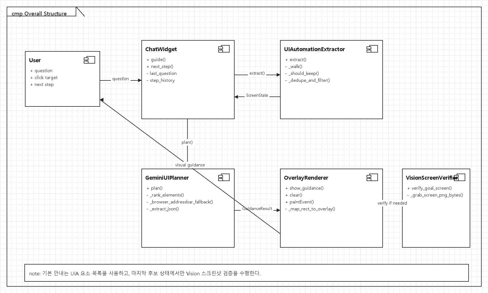
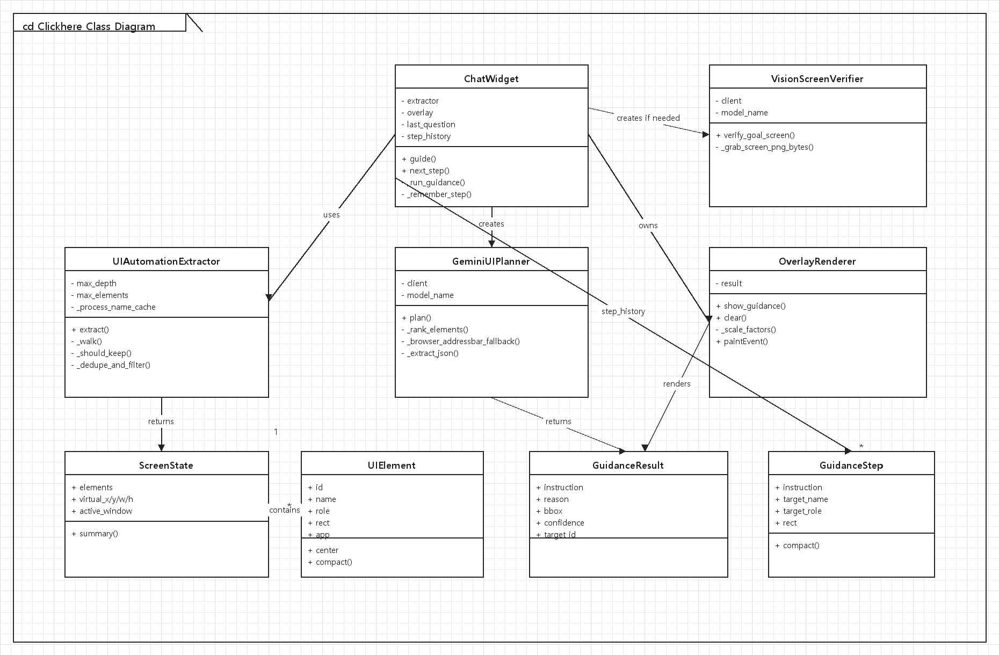
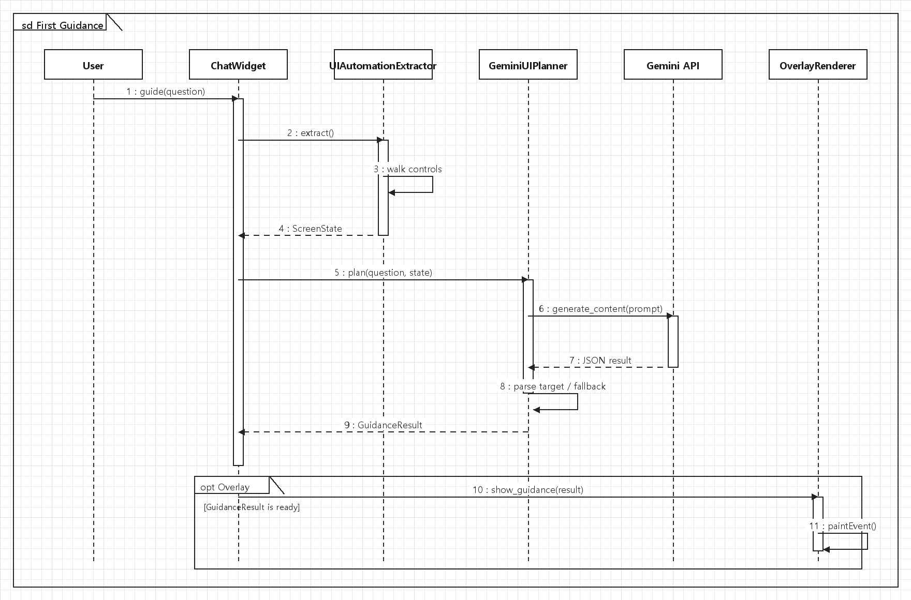
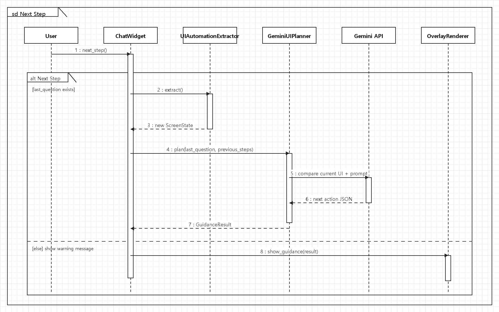
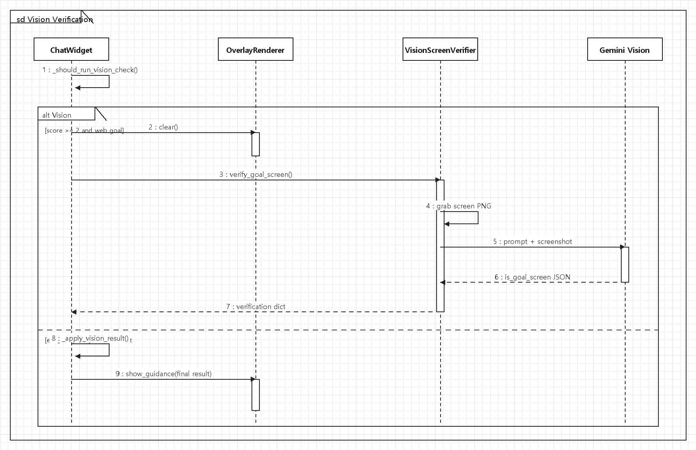
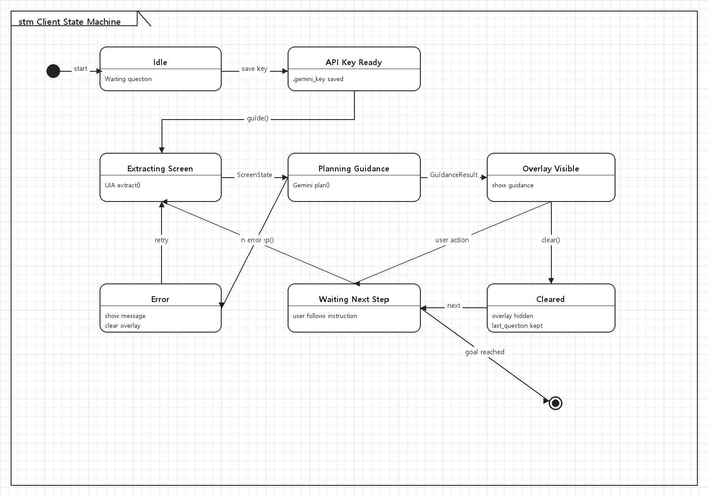
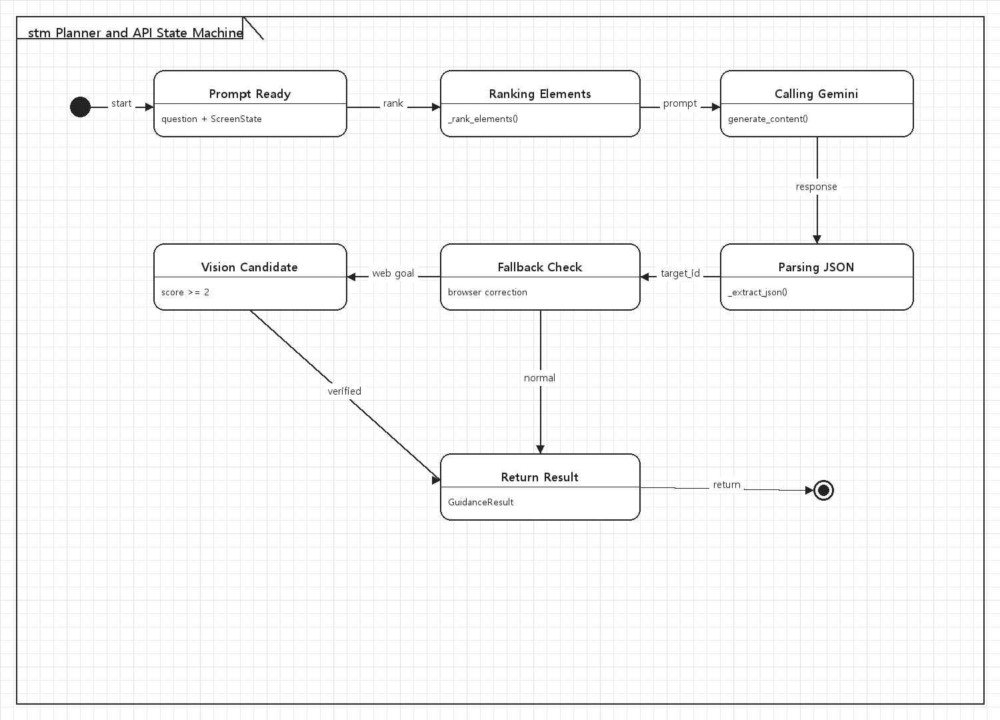

  

<h1 align="center">Click here</h1>

<h3 align="center">3. Design Document</h3>

  

<table align="center">
  <tr>
    <td align="center"><b>Student No.</b></td>
    <td align="center">22413561</td>
  </tr>
  <tr>
    <td align="center"><b>Name</b></td>
    <td align="center">황지원</td>
  </tr>
  <tr>
    <td align="center"><b>E-mail</b></td>
    <td align="center">dyint1029@naver.com</td>
  </tr>
</table>

 

## Revision history

| Revision date | Version # | Description | Author |
|---|---:|---|---|
| 03/25/2026 | 1.00 | First draft | 황지원 |
| 04/28/2026 | 1.10 | Analysis 단계에서 UIA 기반 요소 추출, DPI 보정, 마지막 Vision 검증 구조 반영 | 황지원 |
| 06/04/2026 | 2.00 | Design document 작성: class, sequence, state machine, implementation requirements 정리 | 황지원 |

## Contents

- [1. Introduction](#1-introduction)
- [2. Class diagram](#2-class-diagram)
- [3. Sequence diagram](#3-sequence-diagram)
- [4. State machine diagram](#4-state-machine-diagram)
- [5. Implementation requirements](#5-implementation-requirements)
- [6. Glossary](#6-glossary)
- [7. References](#7-references)

---

## 1. Introduction

이 문서는 지적장애 사용자와 컴퓨터 초보자를 위한 Windows 데스크톱 화면 안내 프로그램 Clickhere의 Design 단계 보고서이다. Analysis 단계에서 정의한 use case와 실제 프로토타입 `main.py`의 구조를 바탕으로, 구현 가능한 클래스 구조와 주요 상호작용 흐름, 상태 변화, 구현 요구사항을 정리하였다.

Clickhere는 사용자가 자연어로 목표를 입력하면 현재 화면에 보이는 버튼, 입력창, 링크, 메뉴 등의 UI 요소를 Windows UI Automation으로 수집하고, Gemini API가 그중 다음에 선택해야 할 요소를 결정하도록 설계되었다. 결과는 PyQt6 기반의 투명 오버레이로 표시되며, 오버레이는 사용자의 실제 클릭을 막지 않는다.

- 기본 안내 단계에서는 전체 스크린샷을 매번 전송하지 않고 UIA 요소 목록만 사용하여 개인정보 노출과 응답 부담을 줄인다.
- DPI awareness와 virtual screen 좌표를 사용하여 다중 모니터와 배율 환경에서도 UIA 좌표와 오버레이 좌표가 어긋나지 않도록 한다.
- YouTube와 같은 브라우저 목표에서는 마지막 후보 상태에서만 Gemini Vision으로 목표 화면 도착 여부를 확인한다.
- 개인정보 입력, 결제, 삭제, 전송처럼 위험한 행동은 직접 클릭을 유도하지 않고 사용자가 판단할 수 있는 안내만 제공한다.

전체 설계의 중심은 `ChatWidget`이다. `ChatWidget`은 API Key 저장, 질문 입력, UI 요소 추출, Gemini 계획 요청, Vision 검증 조건 판단, 오버레이 표시를 순서대로 연결한다. 나머지 클래스들은 이 흐름 안에서 한 가지 책임을 갖도록 분리하였다.

  

<b>Figure 1. Overall design structure</b>

---

## 2. Class diagram

Class diagram은 실제 프로토타입 코드의 클래스를 기준으로 작성하였다. 데이터 클래스는 UI 요소와 안내 결과를 저장하고, 서비스 클래스는 화면 추출과 AI 판단을 담당하며, PyQt UI 클래스는 사용자 입력과 오버레이 표시를 담당한다.

  

<b>Figure 2. Clickhere 전체 class diagram</b>

### 2.1 Class Description

| Class | Main attributes | Main methods | Description |
|---|---|---|---|
| `UIElement` | `id`, `name`, `role`, `rect`, `app`, `class_name`, `automation_id`, `depth` | `center`, `compact()` | Windows UI Automation에서 추출한 화면 요소 하나를 표현한다. `target_id` 선택과 오버레이 좌표 계산의 기본 단위이다. |
| `ScreenState` | `elements`, `virtual_x`, `virtual_y`, `virtual_w`, `virtual_h`, `active_window` | `summary()` | 현재 디스플레이 상태를 저장한다. Gemini에게 전달할 화면 요약과 UI 요소 목록을 만든다. |
| `GuidanceResult` | `instruction`, `reason`, `bbox`, `target_point`, `confidence`, `target_id` | - | AI 계획 결과를 저장한다. 오버레이 표시와 상태창 출력에 필요한 안내 문장, 좌표, 신뢰도를 포함한다. |
| `GuidanceStep` | `instruction`, `target_name`, `target_role`, `rect`, `confidence` | `compact()` | 이전 안내 기록을 저장한다. 다음 단계 요청 시 현재 화면이 실제로 변화했는지 비교하는 데 사용된다. |
| `UIAutomationExtractor` | `max_depth`, `max_elements`, process cache | `extract()`, `_walk()`, `_should_keep()`, `_dedupe_and_filter()` | 현재 화면에서 보이는 UI 요소를 순회하고, 너무 작은 요소나 중복 요소, Clickhere 자체 UI를 제외한다. |
| `GeminiUIPlanner` | `client`, `model_name` | `plan()`, `_rank_elements()`, `_browser_addressbar_fallback()` | 사용자 질문과 UI 요소 목록을 Gemini에 전달하여 다음 행동 하나를 결정한다. 브라우저 주소창 fallback도 포함한다. |
| `VisionScreenVerifier` | `client`, `model_name` | `verify_goal_screen()`, `_grab_screen_png_bytes()` | 마지막 후보 상태에서 스크린샷을 사용해 목표 화면 도착 여부를 검증한다. |
| `OverlayRenderer` | `result` | `show_guidance()`, `clear()`, `paintEvent()` | 투명 오버레이를 화면 위에 그리고, target bbox에 강조 박스와 말풍선을 표시한다. |
| `ChatWidget` | `key_input`, `question_input`, `status`, `step_history` | `guide()`, `next_step()`, `_run_guidance()`, `_remember_step()` | 오른쪽 아래 질문창이며 전체 use case 흐름을 제어한다. |

### 2.2 Design Rationale

프로토타입은 하나의 `main.py` 안에 구현되어 있지만 설계 관점에서는 데이터 객체, 화면 추출기, AI 계획기, 검증기, UI 표현 클래스로 역할을 나눌 수 있다. 이 분리는 향후 파일 구조를 모듈화할 때도 그대로 유지할 수 있다.

- `UIElement`와 `ScreenState`는 AI에게 전달되는 입력 데이터를 안정적으로 구조화한다.
- `GuidanceResult`와 `GuidanceStep`은 현재 안내 결과와 과거 안내 기록을 분리하여 다음 단계 판단을 단순하게 만든다.
- `UIAutomationExtractor`는 Windows 접근성 트리 처리만 담당하여 PyQt UI 코드와 분리된다.
- `GeminiUIPlanner`는 AI 응답 파싱과 fallback 규칙을 포함하므로, 모델 변경이나 prompt 수정이 한 곳에서 이루어진다.
- `OverlayRenderer`는 클릭 이벤트를 통과시키는 표시 전용 창으로 설계하여 사용자가 안내 위치를 실제로 클릭할 수 있게 한다.

---

## 3. Sequence diagram

Sequence diagram은 Analysis 단계의 주요 use case를 기준으로 작성하였다. 실제 프로그램의 사용자 흐름은 API Key 저장 후 질문 입력, UI 요소 추출, AI 계획, 오버레이 표시, 다음 단계 반복으로 이어진다.

### 3.1 First Guidance Sequence

  

<b>Figure 3. 질문 입력 후 첫 안내가 표시되는 흐름</b>

사용자가 질문을 입력하면 `ChatWidget`은 이전 단계 기록을 초기화하고 현재 화면을 분석한다. `UIAutomationExtractor`가 `ScreenState`를 반환하면 `GeminiUIPlanner`가 `target_id`를 선택하고, `ChatWidget`은 이를 `OverlayRenderer`에 넘겨 화면 위에 표시한다.

### 3.2 Next Step Sequence

  

<b>Figure 4. 사용자가 다음 단계 버튼을 눌렀을 때의 흐름</b>

다음 단계 요청에서는 `last_question`과 `step_history`가 유지된다. `GeminiUIPlanner`는 이전 안내 기록을 단순히 완료된 것으로 가정하지 않고, 현재 UI 요소 목록과 비교하여 화면이 바뀌었는지 판단한다. 같은 상태가 반복되면 같은 행동을 안내할 수 있지만 문장은 지나치게 기계적으로 반복하지 않는다.

### 3.3 Vision Verification Sequence

  

<b>Figure 5. 마지막 후보 상태에서 Vision 검증이 수행되는 흐름</b>

Vision 검증은 모든 단계에서 수행되지 않는다. 웹/브라우저 목표이고 이전 단계, 현재 UIA 단서, 안내 결과가 목표 화면 근처에 도달했음을 암시할 때만 실행된다. 이 방식은 개인정보 노출 가능성과 API 비용을 줄이면서도, YouTube 화면에 이미 도착했는데 주소창 클릭을 반복하는 문제를 줄인다.

### 3.4 Clear Overlay Sequence

| Step | Sender | Receiver | Message |
|---:|---|---|---|
| 1 | User | `ChatWidget` | 지우기 버튼 클릭 |
| 2 | `ChatWidget` | `OverlayRenderer` | `clear()` 호출 |
| 3 | `OverlayRenderer` | `OverlayRenderer` | `result`를 `None`으로 설정 |
| 4 | `OverlayRenderer` | User | 오버레이 창을 숨김 |

오버레이 지우기는 질문 기록을 삭제하지 않는다. 사용자는 필요하면 다음 단계 버튼을 눌러 같은 목표를 계속 진행할 수 있다.

---

## 4. State machine diagram

State machine diagram은 사용자가 보는 client 상태와 Gemini/API 계획 처리 상태를 나누어 표현하였다. 이 프로그램은 별도의 서버를 직접 운영하지 않지만, Gemini API 호출과 Vision 검증을 외부 AI service 상태로 볼 수 있으므로 client와 planner/API 상태를 분리하였다.

### 4.1 Client State Machine

  

<b>Figure 6. Clickhere client state machine</b>

Client는 대기 상태에서 API Key 저장 또는 질문 입력을 기다린다. 안내 요청이 들어오면 화면 요소를 추출하고 계획 결과를 받은 뒤 오버레이를 표시한다. 사용자가 다음 단계 버튼을 누르면 다시 화면 추출 상태로 돌아가며, 오류가 발생하거나 사용자가 지우기를 누르면 Error/Cleared 상태로 이동한다.

### 4.2 Planner/API State Machine

  

<b>Figure 7. Gemini planner and API state machine</b>

Planner/API 상태는 prompt 준비, 요소 순위화, Gemini 호출, JSON 응답 파싱, fallback 검사로 이어진다. 일반 안내라면 바로 `GuidanceResult`를 반환하고, 브라우저 목표의 마지막 후보 상태라면 Vision 검증 후보 상태로 이동한 뒤 최종 결과를 반환한다.

---

## 5. Implementation requirements

Implementation requirements는 실제 Clickhere 프로토타입 실행에 필요한 환경, 외부 API, 기능 조건, 예외 처리 기준을 정리한 것이다.

| Category | Requirement | Reason |
|---|---|---|
| Operating System | Windows 10 이상 권장 | Windows UI Automation과 DPI awareness API를 사용하므로 Windows 환경이 필요하다. |
| Language | Python 3.10 이상 | PyQt6, google-genai, uiautomation 등 주요 패키지와 호환되는 버전이 필요하다. |
| GUI Framework | PyQt6 | 질문 입력창과 항상 위 투명 오버레이를 구현한다. |
| Screen Extraction | `uiautomation` package | 현재 디스플레이의 버튼, 입력창, 링크, 메뉴, 창 정보를 추출한다. |
| AI API | Google Gemini API Key | 사용자 질문과 UI 요소 목록을 비교해 다음 행동을 결정한다. |
| Vision Verification | Gemini Vision 지원 모델 | 마지막 후보 상태에서 목표 화면 도착 여부를 스크린샷으로 검증한다. |
| Environment File | `.env` 또는 `.gemini_key` | API Key를 저장하고 다음 실행 시 자동으로 불러온다. |
| Security | 위험 행동 직접 클릭 금지 | 개인정보 입력, 결제, 삭제, 전송 등은 자동 클릭을 유도하지 않는다. |

### 5.1 Functional Requirements

- 사용자는 Gemini API Key를 입력하고 저장할 수 있어야 한다.
- 사용자는 자연어 질문을 입력하고 안내 버튼 또는 Enter로 첫 안내를 요청할 수 있어야 한다.
- 시스템은 현재 화면의 UI 요소를 추출하고, 너무 작거나 중복된 요소와 Clickhere 자체 UI는 제외해야 한다.
- 시스템은 Gemini 응답에서 `target_id`를 파싱하고 실제 `UIElement`의 `bbox`와 `center`를 계산해야 한다.
- 대상 요소가 있으면 오버레이는 강조 박스, 중심 표시, 화살표, 안내 말풍선을 표시해야 한다.
- 대상 요소가 없으면 위치 표시 없이 수행해야 할 키보드 입력이나 일반 안내 문장만 표시해야 한다.
- 다음 단계 버튼은 이전 질문을 유지하고 최근 안내 기록을 바탕으로 현재 화면을 다시 분석해야 한다.
- Vision 검증은 점수 조건을 만족하는 웹/브라우저 목표에서만 수행해야 한다.

### 5.2 Non-functional Requirements

| Item | Requirement |
|---|---|
| Usability | 안내 문장은 한 번에 하나의 행동만 포함하고, 지적장애 사용자도 이해할 수 있도록 짧고 직접적인 표현을 사용한다. |
| Performance | UI 요소 추출은 일반적인 데스크톱 환경에서 수 초 이내 수행되는 것을 목표로 한다. Gemini 호출 시간은 네트워크 상태와 모델 응답 시간에 따라 달라질 수 있다. |
| Privacy | 기본 안내는 스크린샷이 아니라 UI 요소 목록을 사용한다. 스크린샷은 목표 화면 검증이 필요한 마지막 후보 상태에서만 사용한다. |
| Reliability | UIA 요소가 부족한 환경에서는 주소창 fallback, Ctrl+L 안내, 일반 안내 문장으로 보정한다. |
| Compatibility | 다중 모니터와 화면 배율 차이를 고려하여 virtual screen 좌표와 overlay 좌표의 scale factor를 계산한다. |

### 5.3 Error Handling

| Situation | Handling |
|---|---|
| API Key가 비어 있음 | 메시지 박스로 키 입력을 요청하고 안내 흐름을 시작하지 않는다. |
| UI 요소가 추출되지 않음 | 현재 화면에서 누를 수 있는 요소를 찾지 못했으므로 창을 한 번 클릭한 뒤 다시 안내를 누르도록 안내한다. |
| Gemini 응답 JSON 파싱 실패 | `target_id`를 `null`로 처리하고 안전한 일반 안내 또는 오류 메시지를 표시한다. |
| `target_id`가 요소 목록에 없음 | 잘못된 `target_id`를 무시하고 위치 표시 없이 안내 문장만 보여준다. |
| 스크린샷 캡처 실패 | Vision 검증 실패로 처리하고 기존 UIA 안내를 유지한다. |
| 오버레이 좌표 불일치 | virtual screen 크기와 overlay 크기의 scale factor를 다시 계산하여 표시한다. |

---

## 6. Glossary

| Term | Description |
|---|---|
| Clickhere | 지적장애 사용자와 컴퓨터 초보자를 위해 현재 화면에서 눌러야 할 위치를 안내하는 Windows 데스크톱 프로그램 |
| ChatWidget | 화면 오른쪽 아래에 표시되는 질문 입력창. API Key 저장, 질문 입력, 안내, 다음 단계, 지우기 기능을 제공한다. |
| OverlayRenderer | 현재 화면 위에 표시되는 투명 안내 레이어. 사용자의 실제 클릭은 막지 않는다. |
| UI Automation / UIA | Windows 프로그램의 버튼, 입력창, 링크, 메뉴 등 접근성 정보를 읽는 기술 |
| BoundingRectangle | UIA 요소가 화면에서 차지하는 x, y, width, height 좌표 정보 |
| Virtual Screen | 다중 모니터를 포함한 Windows 전체 가상 화면 영역 |
| DPI Awareness | Windows 화면 배율이 달라져도 좌표가 어긋나지 않도록 하는 설정 |
| Gemini API | Google Gemini 모델을 프로그램에서 호출하기 위한 외부 AI API |
| Gemini Vision | 스크린샷 같은 이미지 입력을 함께 받아 화면 상태를 판단하는 Gemini 기능 |
| GuidanceResult | AI가 생성한 안내 결과 데이터. 안내문, 이유, 좌표, 신뢰도, `target_id`를 포함한다. |
| GuidanceStep | 이전에 사용자에게 제공한 안내 기록. 다음 단계 판단 시 사용된다. |
| Target ID | UI 요소 목록 중 Gemini가 선택한 대상 요소의 고유 번호 |
| Fallback | AI 판단이 불확실하거나 주소창을 직접 찾지 못했을 때 사용하는 보정 규칙 |

---

## 7. References

[1] Python Software Foundation, Python Documentation.  
[2] Riverbank Computing, PyQt6 Documentation.  
[3] Microsoft, Windows UI Automation Documentation.  
[4] Google, Gemini API Documentation.  
[5] Clickhere prototype source code, `main.py`, version 3.4.  
[6] Analysis report: `2. [Analysis] 22413561_황지원.hwp`.
